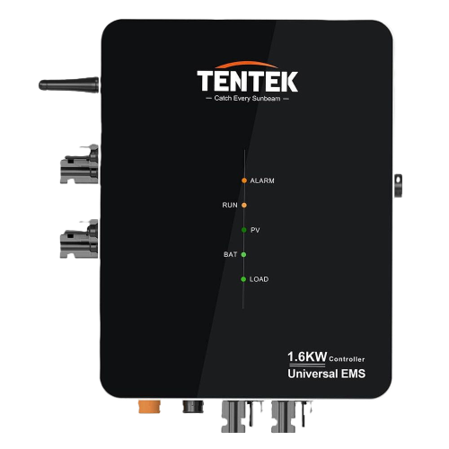
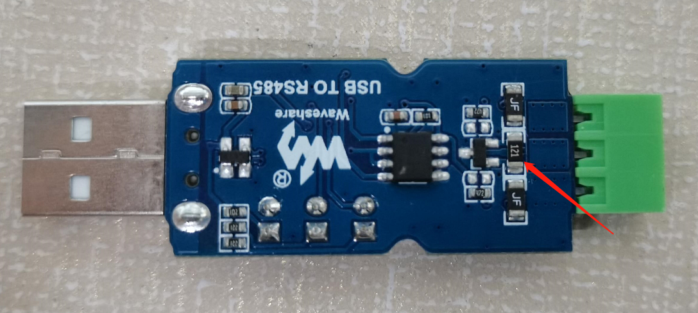
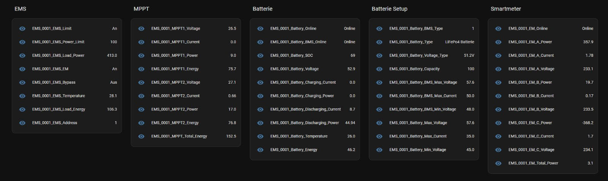

# RS485 zu MQTT Schnittstelle für den Tentek EMS



Dieses Projekt bietet eine Schnittstelle zwischen RS485-Kommunikation und MQTT für den Tentek EMS Controller. Es ermöglicht dem EMS, mit einem MQTT-Broker zu kommunizieren, um verschiedene Topics zu veröffentlichen und zu abonnieren, was eine Fernsteuerung und -überwachung ermöglicht.

## Inhaltsverzeichnis
- [Übersicht](#übersicht)
- [Funktionen](#funktionen)
- [Setup und Installation](#setup-und-installation)
- [Konfiguration](#konfiguration)
- [Verwendung](#verwendung)
- [Protokollierung](#protokollierung)
- [MQTT-Topics](#mqtt-topics)
- [HomeAssistant MQTT-Entitäten](#homeassistant-mqtt-entitäten)
- [Lizenz](#lizenz)

## Übersicht
Das Skript liest Daten von einem EMS über RS485, verarbeitet sie und veröffentlicht sie an einen MQTT-Broker. Es abonniert auch MQTT-Topics, um das EMS zu steuern.

## Funktionen
- Lesen und Schreiben von EMS-Registerwerten über RS485
- Veröffentlichen von EMS-Daten an MQTT-Topics
- Abonnieren von MQTT-Topics zur Steuerung der EMS-Einstellungen
- Protokollierung von Ereignissen und Fehlern

## Setup und Installation
### Benötigte Hardware
- Raspberry Pi
- SD-Karte
- [USB to RS485 Converter](https://www.amazon.de/dp/B081MZLY6G) oder [RS485 CAN HAT](https://www.amazon.de/gp/product/B09JKJCMHN)

### Voraussetzungen
- Python 3.x
- `pyserial` Bibliothek für RS485-Kommunikation
- `paho-mqtt` Bibliothek für MQTT-Kommunikation

### RS485 Verkabelung 
Stelle sicher, dass der EMS (und die Batterie richtig) am RPi angeschlossen ist/sind.

#### Variante 1
| EMS RS485                    | RPi RS485 (ohne 120 Ohm Widerstand)  | BMS RS485                                         |
|------------------------------|--------------------------------------|---------------------------------------------------|
| Pin 1                        | Anschluss A                          | Pin 6                                             |
| Pin 5                        | Anschluss B                          | Pin 5                                             |

#### Variante 2
| EMS RS485                    | RPi RS485 (mit 120 Ohm Widerstand)  |
|------------------------------|-------------------------------------|
| Pin 1                        | Anschluss A                         |
| Pin 5                        | Anschluss B                         | 

### Anleitungen für Installation von
- [Raspberry Pi OS](https://www.raspberrypi.com/documentation/computers/getting-started.html)
- [RS485 CAN HAT am RPi](https://www.waveshare.com/wiki/RS485_CAN_HAT#RS485_Usage) (falls verwendet)

### Vorbereitung des USB to RS485 Converters (falls verwendet)

Dieser Schitt muss bei Variante 2 ausgelassen werden!

Leider kommen die "USB to RS485"-Converter immer mit einem 120 Ohm Widerstand. Dieser muss "ausgebaut" werden, da es sonst zu Störungen zwischen EMS und dem BMS kommt. Wichtig ist, dass dabei die Platine nicht beschädigt wird und dass kein Kontakt zwischen Anschluss A und Abnschluss B entsteht.



## Konfiguration
### EMS Konfiguration
Setze die EMS-Nummer (falls mehrere EMS ausgelesen werden):
```python
EMS_Nr = "0001"
```

### RS485 Konfiguration
Herausfinden des angeschlossenen RS485

USB to RS485:
```bash
sudo ls -l /dev/ttyUSB*
```

RS485 HAT:
```bash
sudo ls -l /dev/ttyS*
```

Setzen des RS485-Seriellen Ports:
```python
RS485_PORT = "/dev/ttyUSB0"
```

### MQTT Konfiguration
Setze die Verbindungsparameter des MQTT-Brokers:
```python
MQTT_BROKER = "192.168.178.123"
MQTT_PORT = 1883
MQTT_USERNAME = "mqtt"
MQTT_PASSWORD = "12345"
```

### Protokollierungskonfiguration
Setze die Protokollierungsparameter:
```python
LOG_LEVEL = logging.INFO
LOG_FILE = "/home/pi/ems_mqtt/your_script_name.log"
```

## Verwendung

### Ausführen des Programms
Führe das Skript aus:
   ```bash
   python3 ems_rs485_to_mqtt.py
   ```

### Service einrichten
Erstelle eine neue Service-Datei für systemd
```bash
sudo nano /etc/systemd/system/ems_mqtt.service
```

Füge folgenden Inhalt ein (bitte Pfad anpassen)
```bash
[Unit]
Description=RS485 to MQTT Service for EMS
After=network.target

[Service]
ExecStart=/usr/bin/python3 /home/pi/ems_mqtt/ems_rs485_to_mqtt.py
WorkingDirectory=/home/pi/ems_mqtt
StandardOutput=inherit
StandardError=inherit
Restart=always
User=pi

[Install]
WantedBy=multi-user.target
```

Aktiviere den neuen Service, sodass er beim Booten automatisch gestartet wird.
```bash
sudo systemctl enable ems_mqtt.service
```

Starte den Service
```bash
sudo systemctl start ems_mqtt.service
```

## Protokollierung
Das Skript protokolliert verschiedene Ereignisse und Fehler. Die Protokolldatei wird durch die Variable `LOG_FILE` angegeben.

### Protokollierungsstufen
- `DEBUG`: Detaillierte Informationen zur Diagnose von Problemen.
- `INFO`: Bestätigung, dass alles wie erwartet funktioniert.
- `WARNING`: Ein Hinweis darauf, dass etwas Unerwartetes passiert ist.
- `ERROR`: Ein ernsteres Problem.
- `CRITICAL`: Ein sehr ernstes Problem.

## MQTT Topics

Ersetze `{EMS_Nr}` durch die tatsächliche EMS-Nummer in allen Topics.

| Schreibende Topics (Abonnieren)                     | Beschreibung                          | Wert                                              |
|-----------------------------------------------------|---------------------------------------|---------------------------------------------------|
| solar/ems/{EMS_Nr}/EMS_EM/turn                      | EMS Nulleinspeisung ein-/ausschalten  | String ("on" oder "off")                          |
| solar/ems/{EMS_Nr}/EMS_Bypass/turn                  | EMS Bypass ein-/ausschalten           | String ("on" oder "off")                          |
| solar/ems/{EMS_Nr}/EMS_Power_Limit/set              | EMS Leistungsbegrenzung setzen        | Integer (0-1600 W)                                |

| Lesende Topics (Veröffentlichen)                    | Beschreibung                       | Wert                                              |
|-----------------------------------------------------|------------------------------------|---------------------------------------------------|
| solar/ems/{EMS_Nr}/EMS_Limit                        | EMS Leistungsgrenze                | String ("on" oder "off")                          |
| solar/ems/{EMS_Nr}/EMS_Power_Limit                  | EMS Leistungsbegrenzung            | Integer (Watt)                                    |
| solar/ems/{EMS_Nr}/EMS_Load_Power                   | EMS Lastleistung                   | Integer (Watt)                                    |
| solar/ems/{EMS_Nr}/EMS_EM                           | EMS Nulleinspeisung                | String ("on" oder "off")                          |
| solar/ems/{EMS_Nr}/EMS_Bypass                       | EMS Bypass                         | String ("on" oder "off")                          |
| solar/ems/{EMS_Nr}/EMS_Temperature                  | EMS Temperatur                     | Gleitkommazahl (in °C)                            |
| solar/ems/{EMS_Nr}/EMS_Load_Energy                  | EMS Lastenergie                    | Gleitkommazahl (in kWh)                           |
| solar/ems/{EMS_Nr}/MPPT1_Voltage                    | MPPT1 Spannung                     | Gleitkommazahl (in Volt)                          |
| solar/ems/{EMS_Nr}/MPPT1_Current                    | MPPT1 Strom                        | Gleitkommazahl (in Ampere)                        |
| solar/ems/{EMS_Nr}/MPPT1_Power                      | MPPT1 Leistung                     | Gleitkommazahl (in Watt)                          |
| solar/ems/{EMS_Nr}/MPPT1_Energy                     | MPPT1 Energie                      | Gleitkommazahl (in kWh)                           |
| solar/ems/{EMS_Nr}/MPPT2_Voltage                    | MPPT2 Spannung                     | Gleitkommazahl (in Volt)                          |
| solar/ems/{EMS_Nr}/MPPT2_Current                    | MPPT2 Strom                        | Gleitkommazahl (in Ampere)                        |
| solar/ems/{EMS_Nr}/MPPT2_Power                      | MPPT2 Leistung                     | Gleitkommazahl (in Watt)                          |
| solar/ems/{EMS_Nr}/MPPT2_Energy                     | MPPT2 Energie                      | Gleitkommazahl (in kWh)                           |
| solar/ems/{EMS_Nr}/MPPT_Total_Energy                | Gesamte MPPT Energie               | Gleitkommazahl (in kWh)                           |
| solar/ems/{EMS_Nr}/Battery_Online                   | Batterie Online                    | String ("Online" oder "Offline")                  |
| solar/ems/{EMS_Nr}/Battery_BMS_Online               | Batterie BMS Online                | String ("Online" oder "Offline")                  |
| solar/ems/{EMS_Nr}/Battery_SOC                      | Batterie Ladezustand (SOC)         | Integer (in %)                                    |
| solar/ems/{EMS_Nr}/Battery_Voltage                  | Batteriespannung                   | Gleitkommazahl (in Volt)                          |
| solar/ems/{EMS_Nr}/Battery_Charging_Power           | Batterie Ladeleistung              | Gleitkommazahl (in Watt)                          |
| solar/ems/{EMS_Nr}/Battery_Charging_Current         | Batterie Ladestrom                 | Gleitkommazahl (in Ampere)                        |
| solar/ems/{EMS_Nr}/Battery_Discharging_Power        | Batterie Entladeleistung           | Gleitkommazahl (in Watt)                          |
| solar/ems/{EMS_Nr}/Battery_Discharging_Current      | Batterie Entladestrom              | Gleitkommazahl (in Ampere)                        |
| solar/ems/{EMS_Nr}/Battery_Temperature              | Batterietemperatur                 | Gleitkommazahl (in °C)                            |
| solar/ems/{EMS_Nr}/Battery_Energy                   | Batterie Energie                   | Gleitkommazahl (in kWh)                           |
| solar/ems/{EMS_Nr}/Battery_BMS_Type                 | Batterie BMS Typ                   | String                                            |
| solar/ems/{EMS_Nr}/Battery_Type                     | Batterietyp                        | String                                            |
| solar/ems/{EMS_Nr}/Battery_Voltage_Type             | Batteriespannungstyp               | String                                            |
| solar/ems/{EMS_Nr}/Battery_Capacity                 | Batteriekapazität                  | Integer (in Ah)                                   |
| solar/ems/{EMS_Nr}/Battery_BMS_Max_Voltage          | Batterie BMS Maximalspannung       | Gleitkommazahl (in Volt)                          |
| solar/ems/{EMS_Nr}/Battery_BMS_Max_Current          | Batterie BMS Maximalstrom          | Gleitkommazahl (in Ampere)                        |
| solar/ems/{EMS_Nr}/Battery_BMS_Min_Voltage          | Batterie BMS Minimalspannung       | Gleitkommazahl (in Volt)                          |
| solar/ems/{EMS_Nr}/Battery_Max_Voltage              | Batterie Maximalspannung           | Gleitkommazahl (in Volt)                          |
| solar/ems/{EMS_Nr}/Battery_Max_Current              | Batterie Maximalstrom              | Gleitkommazahl (in Ampere)                        |
| solar/ems/{EMS_Nr}/Battery_Min_Voltage              | Batterie Minimalspannung           | Gleitkommazahl (in Volt)                          |
| solar/ems/{EMS_Nr}/EM_Online                        | EM Online                          | String ("Online" oder "Offline")                  |
| solar/ems/{EMS_Nr}/EM_A_Power                       | EM A Leistung                      | Gleitkommazahl (in Watt)                          |
| solar/ems/{EMS_Nr}/EM_A_Current                     | EM A Strom                         | Gleitkommazahl (in Ampere)                        |
| solar/ems/{EMS_Nr}/EM_A_Voltage                     | EM A Spannung                      | Gleitkommazahl (in Volt)                          |
| solar/ems/{EMS_Nr}/EM_B_Power                       | EM B Leistung                      | Gleitkommazahl (in Watt)                          |
| solar/ems/{EMS_Nr}/EM_B_Current                     | EM B Strom                         | Gleitkommazahl (in Ampere)                        |
| solar/ems/{EMS_Nr}/EM_B_Voltage                     | EM B Spannung                      | Gleitkommazahl (in Volt)                          |
| solar/ems/{EMS_Nr}/EM_C_Power                       | EM C Leistung                      | Gleitkommazahl (in Watt)                          |
| solar/ems/{EMS_Nr}/EM_C_Current                     | EM C Strom                         | Gleitkommazahl (in Ampere)                        |
| solar/ems/{EMS_Nr}/EM_C_Voltage                     | EM C Spannung                      | Gleitkommazahl (in Volt)                          |
| solar/ems/{EMS_Nr}/EM_Total_Power                   | Gesamte EM Leistung                | Gleitkommazahl (in Watt)                          |

## HomeAssistant MQTT-Entitäten


   ```yaml
mqtt:
  - number:
    - name: "EMS_0001_EMS_Power_Limit"
      state_topic: "solar/ems/0001/EMS_Power_Limit"
      command_topic: "solar/ems/0001/EMS_Power_Limit/set"
      unit_of_measurement: "W"
      device_class: power
      min: 0
      max: 1600
      mode: box
 
  - switch:
    - name: "EMS_0001_EMS_EM"
      state_topic: "solar/ems/0001/EMS_EM"
      command_topic: "solar/ems/0001/EMS_EM/turn"
      payload_on: "on"
      payload_off: "off"
 
    - name: "EMS_0001_EMS_Bypass"
      state_topic: "solar/ems/0001/EMS_Bypass"
      command_topic: "solar/ems/0001/EMS_Bypass/turn"
      payload_on: "on"
      payload_off: "off"
 
  - sensor:
    - name: "EMS_0001_EMS_Limit"
      state_topic: "solar/ems/0001/EMS_Limit"
      device_class: connectivity

    - name: "EMS_0001_Temperature"
      state_topic: "solar/ems/0001/EMS_Temperature"
      unit_of_measurement: "°C"
      device_class: temperature
 
    - name: "EMS_0001_Load_Energy"
      state_topic: "solar/ems/0001/EMS_Load_Energy"
      unit_of_measurement: "kWh"
      device_class: energy
 
    - name: "EMS_0001_Load_Power"
      state_topic: "solar/ems/0001/EMS_Load_Power"
      unit_of_measurement: "W"
      device_class: power
 
    - name: "EMS_0001_MPPT1_Voltage"
      state_topic: "solar/ems/0001/MPPT1_Voltage"
      unit_of_measurement: "V"
      device_class: voltage
 
    - name: "EMS_0001_MPPT1_Current"
      state_topic: "solar/ems/0001/MPPT1_Current"
      unit_of_measurement: "A"
      device_class: current
 
    - name: "EMS_0001_MPPT1_Power"
      state_topic: "solar/ems/0001/MPPT1_Power"
      unit_of_measurement: "W"
      device_class: power
 
    - name: "EMS_0001_MPPT2_Voltage"
      state_topic: "solar/ems/0001/MPPT2_Voltage"
      unit_of_measurement: "V"
      device_class: voltage
 
    - name: "EMS_0001_MPPT2_Current"
      state_topic: "solar/ems/0001/MPPT2_Current"
      unit_of_measurement: "A"
      device_class: current
 
    - name: "EMS_0001_MPPT2_Power"
      state_topic: "solar/ems/0001/MPPT2_Power"
      unit_of_measurement: "W"
      device_class: power
 
    - name: "EMS_0001_MPPT1_Energy"
      state_topic: "solar/ems/0001/MPPT1_Energy"
      unit_of_measurement: "kWh"
      device_class: energy
 
    - name: "EMS_0001_MPPT2_Energy"
      state_topic: "solar/ems/0001/MPPT2_Energy"
      unit_of_measurement: "kWh"
      device_class: energy
 
    - name: "EMS_0001_MPPT_Total_Energy"
      state_topic: "solar/ems/0001/MPPT_Total_Energy"
      unit_of_measurement: "kWh"
      device_class: energy
 
    - name: "EMS_0001_Battery_Online"
      state_topic: "solar/ems/0001/Battery_Online"
      device_class: connectivity
 
    - name: "EMS_0001_Battery_BMS_Online"
      state_topic: "solar/ems/0001/Battery_BMS_Online"
      device_class: connectivity
 
    - name: "EMS_0001_Battery_SOC"
      state_topic: "solar/ems/0001/Battery_SOC"
      unit_of_measurement: "%"
      device_class: battery
 
    - name: "EMS_0001_Battery_Voltage"
      state_topic: "solar/ems/0001/Battery_Voltage"
      unit_of_measurement: "V"
      device_class: voltage
 
    - name: "EMS_0001_Battery_Charging_Power"
      state_topic: "solar/ems/0001/Battery_Charging_Power"
      unit_of_measurement: "W"
      device_class: power
 
    - name: "EMS_0001_Battery_Charging_Current"
      state_topic: "solar/ems/0001/Battery_Charging_Current"
      unit_of_measurement: "A"
      device_class: current
 
    - name: "EMS_0001_Battery_Discharging_Power"
      state_topic: "solar/ems/0001/Battery_Discharging_Power"
      unit_of_measurement: "W"
      device_class: power
 
    - name: "EMS_0001_Battery_Discharging_Current"
      state_topic: "solar/ems/0001/Battery_Discharging_Current"
      unit_of_measurement: "A"
      device_class: current
 
    - name: "EMS_0001_Battery_Temperature"
      state_topic: "solar/ems/0001/Battery_Temperature"
      unit_of_measurement: "°C"
      device_class: temperature
 
    - name: "EMS_0001_Battery_Energy"
      state_topic: "solar/ems/0001/Battery_Energy"
      unit_of_measurement: "kWh"
      device_class: energy
 
    - name: "EMS_0001_Battery_BMS_Type"
      state_topic: "solar/ems/0001/Battery_BMS_Type"
 
    - name: "EMS_0001_Battery_Type"
      state_topic: "solar/ems/0001/Battery_Type"
 
    - name: "EMS_0001_Battery_Voltage_Type"
      state_topic: "solar/ems/0001/Battery_Voltage_Type"
 
    - name: "EMS_0001_Battery_Capacity"
      state_topic: "solar/ems/0001/Battery_Capacity"
      unit_of_measurement: "Ah"
      device_class: battery
 
    - name: "EMS_0001_Battery_BMS_Max_Voltage"
      state_topic: "solar/ems/0001/Battery_BMS_Max_Voltage"
      unit_of_measurement: "V"
      device_class: voltage
 
    - name: "EMS_0001_Battery_BMS_Max_Current"
      state_topic: "solar/ems/0001/Battery_BMS_Max_Current"
      unit_of_measurement: "A"
      device_class: current
 
    - name: "EMS_0001_Battery_BMS_Min_Voltage"
      state_topic: "solar/ems/0001/Battery_BMS_Min_Voltage"
      unit_of_measurement: "V"
      device_class: voltage
 
    - name: "EMS_0001_Battery_Max_Voltage"
      state_topic: "solar/ems/0001/Battery_Max_Voltage"
      unit_of_measurement: "V"
      device_class: voltage
 
    - name: "EMS_0001_Battery_Max_Current"
      state_topic: "solar/ems/0001/Battery_Max_Current"
      unit_of_measurement: "A"
      device_class: current
 
    - name: "EMS_0001_Battery_Min_Voltage"
      state_topic: "solar/ems/0001/Battery_Min_Voltage"
      unit_of_measurement: "V"
      device_class: voltage
 
    - name: "EMS_0001_EM_Online"
      state_topic: "solar/ems/0001/EM_Online"
      device_class: connectivity
 
    - name: "EMS_0001_EM_A_Power"
      state_topic: "solar/ems/0001/EM_A_Power"
      unit_of_measurement: "W"
      device_class: power
 
    - name: "EMS_0001_EM_A_Current"
      state_topic: "solar/ems/0001/EM_A_Current"
      unit_of_measurement: "A"
      device_class: current
 
    - name: "EMS_0001_EM_A_Voltage"
      state_topic: "solar/ems/0001/EM_A_Voltage"
      unit_of_measurement: "V"
      device_class: voltage
 
    - name: "EMS_0001_EM_B_Power"
      state_topic: "solar/ems/0001/EM_B_Power"
      unit_of_measurement: "W"
      device_class: power
 
    - name: "EMS_0001_EM_B_Current"
      state_topic: "solar/ems/0001/EM_B_Current"
      unit_of_measurement: "A"
      device_class: current
 
    - name: "EMS_0001_EM_B_Voltage"
      state_topic: "solar/ems/0001/EM_B_Voltage"
      unit_of_measurement: "V"
      device_class: voltage
 
    - name: "EMS_0001_EM_C_Power"
      state_topic: "solar/ems/0001/EM_C_Power"
      unit_of_measurement: "W"
      device_class: power
 
    - name: "EMS_0001_EM_C_Current"
      state_topic: "solar/ems/0001/EM_C_Current"
      unit_of_measurement: "A"
      device_class: current
 
    - name: "EMS_0001_EM_C_Voltage"
      state_topic: "solar/ems/0001/EM_C_Voltage"
      unit_of_measurement: "V"
      device_class: voltage
 
    - name: "EMS_0001_EM_Total_Power"
      state_topic: "solar/ems/0001/EM_Total_Power"
      unit_of_measurement: "W"
      device_class: power
   ```

## Lizenz
Dieses Projekt ist unter der MIT-Lizenz lizenziert. Siehe die [LICENSE](LICENSE) Datei für Details.
